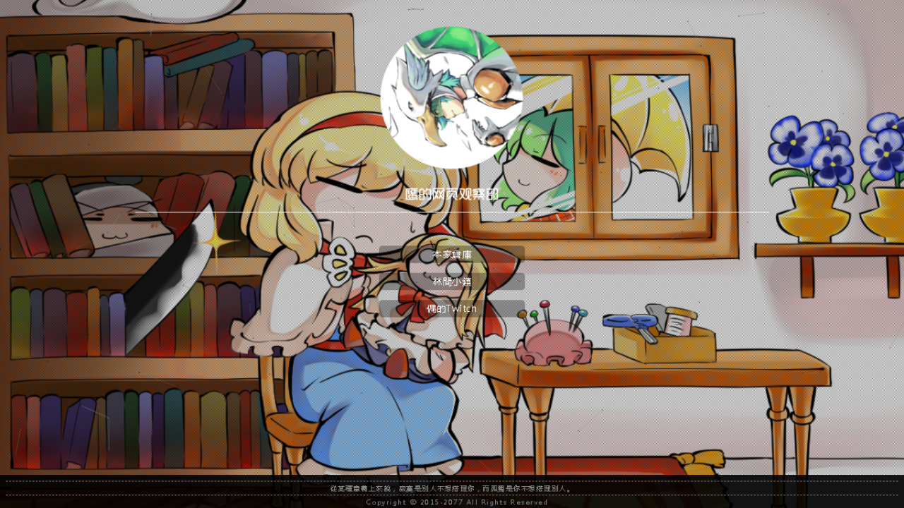

### Hosted by:

# 🦅の網頁

欢迎来到鹰の红石指令部的网页 :D  
作为一个landing page、当然是要找自己最喜欢的样子，对吧 :D  
此网页**非**100%原创，并且是建立与某个网站的模板加以改造而成。

# 網頁模板來源
- 原本來源：[E次元 - 请君心明眼亮](https://acg.xn--fiqs8s/) （最近他们改版了，所以原本的来源找不到了 QAQ）
- 但介於該網頁的優化程度讓我有點汗顔（還有很多資料過期的部分），所以就拿來改裝改裝一下，以上面的藍圖爲基礎，開始改造成自己想要的樣子 :D

# 所使用的各种插件：
### 
- reset —— 把html默认的配置全部归0，重0开始写起。

### 
-  —— 核心JS，也是我目前最喜欢用的框架（或者说，最熟悉的）
- [canvas-nest.js](https://github.com/hustcc/canvas-nest.js) —— 数字网格，具体效果点链接
- norightclick.js —— 防止有人点右键或者inspect element拿源代码的系统
- 各种自制彩蛋，等待你去探索！

### API
- [pic.re](https://pic.re) —— 生成随机背景的API系统
  - 原作者：[tusik](https://github.com/tusik)
- [imgapi.x10408.top](http://imgapi.xl0408.top/index.php) —— 生成随机动漫头像的API系统
  - 原作者：??? 

# 目前改動：
### 
- \<head>\</head>裏面的style全部分開打包，能丟給cdn的都丟給cdn，不能丟的就打包成css導入
- footer 改成隨機名言，更新copyright年份（藏梗）
- 背景API替換 （從 https://ae01.alicdn.com 換成 http://imgapi.xl0408.top/index.php ）

# 效果預覽
https://eaglepb2.github.io/

# 目前BUG 🪱
- 鼠標閃爍問題
